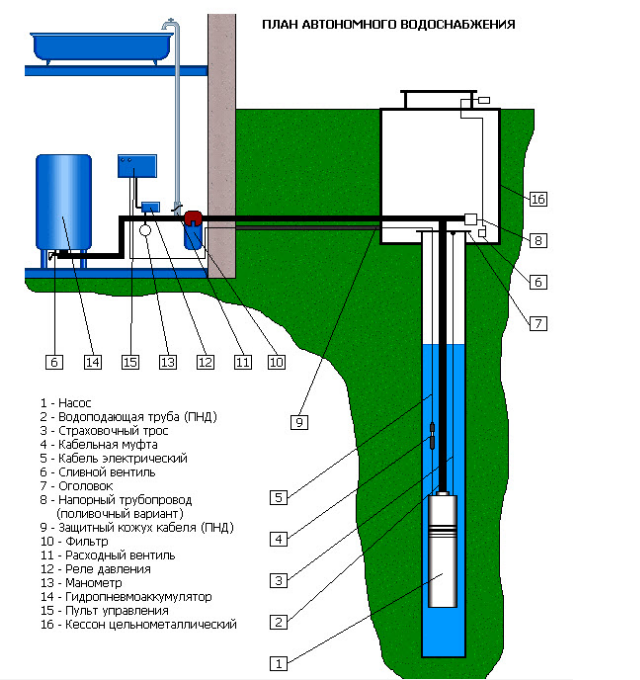

1. Определить место для будущей скважины.
2. Определить ее параметры: способ бурения, глубину.
3. Выполнить бурение.
4. Выполнить обсадку скважины.
5. Произвести прокачку воды.
6. Проверить качество воды.
7. Провести обустройство скважины.
8. Провести воду в дом, установить фильтр.

---

**Что, кроме поиска воды, нужно для скважины?**

1. освободить пространство для оборудования – это специальные установки и трубы, которые будут служить основой скважины;
2. найти источник подачи электроэнергии на участок – если такой возможности нет, мы используем свой генератор для подачи электричества;
3. найти источник технической воды, необходимой для процесса бурения – если такого поблизости нет, то мы приезжаем с водовозом, которые привозит рассчитанное количество воды.

---

**Вращательное бурение**

---

**Оборудование**

---

| название                                                                    | ссылка                                                                                                                                                                                                                                                                                           | цена      |
| :------------------------------------------------------------------------------------ | -------------------------------------------------------------------------------------------------------------------------------------------------------------------------------------------------------------------------------------------------------------------------------------------------------- | --------------- |
| буровая установка                                                   | https://www.olx.ua/d/obyavlenie/burilna-ustanovka-bur-moblniy-bur-IDK3nxP.html#d799e268fehttps://www.olx.ua/d/obyavlenie/burilna-ustanovka-bur-moblniy-bur-IDK3nxP.html#d799e268fe                                                                                                                     | 24к грн   |
| шнек                                                                            | https://www.olx.ua/d/obyavlenie/prodam-shnek-dlya-burilnoy-ustanovki-mrk-750-IDEmHcU.html#6dbeb901cbhttps://www.olx.ua/d/obyavlenie/prodam-shnek-dlya-burilnoy-ustanovki-mrk-750-IDEmHcU.html#6dbeb901cb                                                                                               | 40к грн   |
| Бурильная установка компактная                          | https://www.olx.ua/d/obyavlenie/burilnaya-ustanovka-kompaktnaya-IDNhYqb.html#35a1b4cdb7https://www.olx.ua/d/obyavlenie/burilnaya-ustanovka-kompaktnaya-IDNhYqb.html#35a1b4cdb7                                                                                                                         | 44.5к грн |
| Малогабаритная бурильная (буровая) установка | https://www.olx.ua/d/obyavlenie/malogabaritnaya-burilnaya-burovaya-ustanovka-v-sbore-shtanga-75-metrov-IDNbdoh.html?isPreviewActive=0&sliderIndex=3https://www.olx.ua/d/obyavlenie/malogabaritnaya-burilnaya-burovaya-ustanovka-v-sbore-shtanga-75-metrov-IDNbdoh.html?isPreviewActive=0&sliderIndex=3 | 64к грн   |
| Кессон для скважин из полипропилена                  | https://www.olx.ua/d/obyavlenie/kesson-dlya-skvazhin-iz-polipropilena-IDMBZ8Z.html?sd=1#e30410d46ehttps://www.olx.ua/d/obyavlenie/kesson-dlya-skvazhin-iz-polipropilena-IDMBZ8Z.html?sd=1#e30410d46e                                                                                                   | 15.7к грн |

